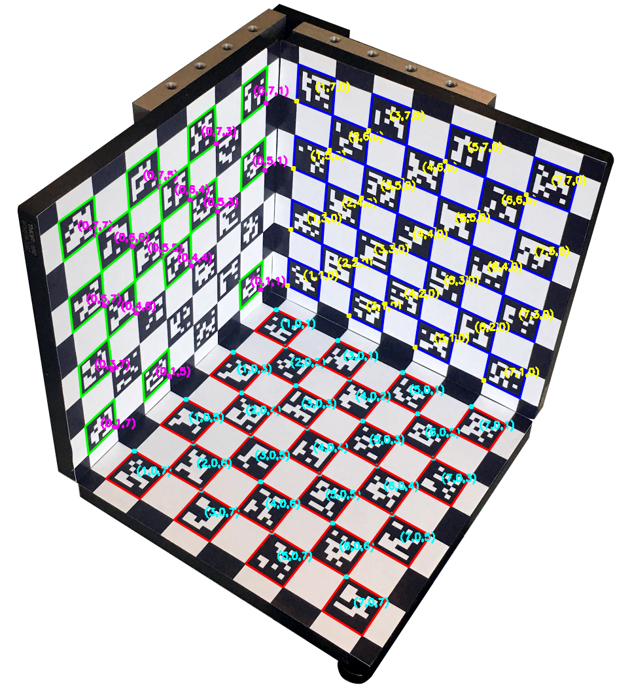

# Camera Calibration
A comprehensive C++ camera calibration program that performs both intrinsic and stereo
calibration and supports a non planar calibration rig.

## Overview
This program performs two types of camera calibration, which are essential steps in many
applications related to computer vision. The first type is intrinsic camera calibration,
which determines the intrinsic camera matrix and distortion coefficients. It uses a set of images
of a calibration pattern with known geometry, such as a chessboard. These resulting intrinsics
can be used to correct an image's radial distortion. They are also inputted as a model for the camera
in the next type of calibration: extrinsic stereo calibration. Stereo calibration determines
the spatial relationship between the two viewpoints of a stereo camera setup, calculating the
rotation and translation transformations. The program uses these extrinsic parameters to produce
rectified image pairs, which are required for the important process of stereo matching.
In a perfectly rectified pair, each point on one image is on the same horizontal line as its
corresponding point in the other image.

The program integrates OpenCV functions with Rafael Munoz-Salinas' [ArUco library](https://sourceforge.net/projects/aruco/), adapted to support a novel 3D ArUco calibration rig.
Calibration with a non planar rig
requires precalculated camera intrinsics, so the program can input intrinsics from a file
(this could be easily adapted to support any sort of non planar rig). The program is controlled
by a comprehensive settings class, which is inputted as a YAML or XML file. These settings support a
host of UI and output features, such as a live camera preview mode, the ability to save detected,
undistorted, and rectified images, and the ability to display the 3D coordinates of an ArUco pattern.



This program was developed for a Middlebury College undergraduate summer research project,
led by professor Daniel Scharstein. Camera calibration will be one component of
a pipeline designed to create datasets for 3D reconstruction on mobile devices.
These datasets will become the next entry in the well known Middlebury Computer Vision
Benchmark http://vision.middlebury.edu/. Here is [the poster](utils/readme/poster.png)
from our summer research presentation.

## Installation
### Dependencies
This program requires [OpenCV](http://opencv.org/releases.html) and the
[ArUco library](https://sourceforge.net/projects/aruco/). In OpenCV 3, the ArUco library
is a built in module. This program was developed in OpenCV 2.4.13, and it uses custom ArUco functions
based on the independent and distinct ArUco library linked above. The built in module defines
different classes and functions, so the two are not easily interchangeable.
This program can still be used in OpenCV 3 (there is a branch with the required changes), but that version
does not (yet) use the built in module.

### Instructions
The ArUco library is included in the [source directory](src/aruco-2.0.19). The included copy
is slightly modified from the vanilla sourceforge download. The [CMake file](src/aruco-2.0.19/CMakeLists.txt)
has been altered to build a static library and skip the utilities and tests (lines 43-46). The unrequired
source code and directories have also been removed. To build the library, navigate to the aruco-2.0.19 home
directory and execute the following:
```
mkdir build
cd build
cmake ..
make
```
This process might produce warnings about comparison or OpenMP, but these don't matter
as long as the static library is built. After this library is built, return to the Camera Calibration
home directory and execute `make`. This will create a build folder with the executable
calibrateWithSettings, which runs calibration from an inputted settings file. The program functions
are defined in [calibration.cpp](src/calibration.cpp), which can be included in any sort of main program with
`#include calibration.h` (the makefile requires the flag `-Isrc/` so it can find the header file)

## Usage
The program is run from settings files, which are YAML or XML (this functionality is
adapted from an [example calibration program](https://github.com/AhmedSamara/OpenCV-camera-calibration/blob/master/calibrate_camera.cpp) provided
by OpenCV). The [settings directory](settings/) includes several example settings files, which contain detailed descriptions of each variable. Here is a sample program execution command from the build folder: `./calibrateWithSettings ../settings/intrinsicChessboardSettings.yml`

The program can also write a serialization for settings, using the settings class function write().
To use this functionality, you must uncomment the other write() function outside of the settings class
(check out the [OpenCV Filestorage documentation](http://docs.opencv.org/3.0-rc1/dd/d74/tutorial_file_input_output_with_xml_yml.html) for more information).

The program has three modes: **INTRINSIC**, **STEREO**, and **PREVIEW**. It supports three calibration
patterns: **CHESSBOARD**, **ARUCO_SINGLE**, and **ARUCO_BOX**.

The **INTRINSIC** and **STEREO** modes require a YAML/XML [image list](input/imageLists/) with paths to the input
[images](input/images/), specified by the setting: **imageList_Filename**.

### ArUco Calibration Patterns
The ArUco patterns provide more accurate, robust, and efficient calibration. They are comprised
of markers with unique IDs based on a modified Hamming code. The library functions can recognize and track
these markers within a marker map, which is specified by a configuration file. This
functionality allows precise calibration with partial occlusion (check out this [article](https://www.uco.es/investiga/grupos/ava/node/26) for more details).

The **ARUCO_SINGLE** pattern is a single, planar marker map, while the **ARUCO_BOX** is a specific non-planar
rig with three marker maps mounted onto a precisely dimensioned box. Both of these patterns require a input
[aruco config](input/arucoPatternConfigs/) with paths to the marker map [config files](input/markerMapConfigs/),
specified by the setting: **arucoConfigList_Filename**.

To create your own ArUco pattern, use the [createArucoPatterns](utils/createArucoPatterns.cpp)
utility program. This program will create a user specified amount of marker maps
with no shared markers between them, allowing simultaneous detection of multiple patterns.
It also allows a border of customizable width to be drawn around the marker maps. The program
will output the marker map images and config files, along with an arucoConfig file that specifies the settings and allows the program to properly detect the pattern. The calibration program includes
the novel functionality of printing the 3D coordinates of ArUco marker corners, which requires
knowledge of the 3D plane, marker size, and border size (the necessary values are included in the arucoConfig file). The setting **Show_ArucoMarkerCoordinates** toggles between drawing the marker coordinates or IDs on each detected image.

If you wish to calibrate with a pattern that is neither a single map nor a box setup, the program
will require some adaptation.

### INTRINSIC MODE    
Intrinsic mode uses OpenCV's [calibrateCamera function](http://tinyurl.com/y8t9n4bb) to perform intrinsic camera calibration. It requires an imageList with
images from a single viewpoint ([example set](input/images/intrinsicChessboard/)). It can be run
with all three calibration patterns, but the ArUco box requires intrinsic input (it will use this
input as an initial estimate to be optimized). The recommended pipeline is to calculate
camera intrinsics using a high quality set of chessboard images, then input these intrinsics
into stereo calibration with a set of ArUco box images.  

Intrinsic calibration can be optimized by modifying the flags in the calibrateCamera function
(check the API linked above for more information). The setting **Calibrate_FixDistCoeffs**
is a string of five digits (0 or 1) that controls which distortion coefficients among K1-K5
will be fixed at 0 (1 = fixed). It is recommended to fix distortion coefficients 3-5 ("00111").
Only 1-2 are needed in most cases, and 3 produces significant distortion in stereo rectification.
The settings can also toggle the flags CV_CALIB_FIX_PRINCIPAL_POINT, CV_CALIB_FIX_ASPECT_RATIO,
and CV_CALIB_ZERO_TANGENT_DIST.

The program will output the resulting intrinsics in a file specified by the setting:
**IntrinsicOutput_Filename**. The file will contain the calibration configuration (time, pattern, and flags),
and the calibration results (camera matrix, distortion coefficients, and reprojection error).
These intrinsic files can be used as intrinsic input for future calibration, using the setting: **intrinsicInput_Filename**.

Intrinsic parameters can also be used to correct the radial distortion in the input
images. The setting **Show_UndistortedImages** controls whether or not these undistorted images
are shown after calibration. If the setting **UndistortedImages_Path** is changed from "0,"
the program will try to save these images to the path. It will print an error if this path does
not exist (*the path must be created beforehand*).

### STEREO MODE
Stereo mode uses OpenCV's [stereoCalibrate function](http://tinyurl.com/zx89lxt)
to perform extrinsic stereo calibration. It requires an imageList with image pairs of an
identical scene from two viewpoints ([example set](input/images/stereoChessboard/)). The order
of image paths within the image list must alternate between viewpoints (left1 right1 left2 right2).
Stereo calibration can be run with all three patterns. The **ARUCO_BOX** pattern requires intrinsic input
specified by the **intrinsicInput_Filename**. The function will use these intrinsics as a
fixed model of the camera, using the flag CV_CALIB_FIX_INTRINSIC. With the Chessboard or ArUco single
patterns, this intrinsic input is optional. If it is left at "0," the program will calculate
independent intrinsics for each viewpoint and input these into the stereoCalibrate function.

The program plugs these resulting extrinsics into OpenCV's [stereoRectify function](http://tinyurl.com/y7m4aylu),
which calculates the necessary rectification transformations and projection matrices
to create rectified image pairs. The setting **Show_RectifiedImages** controls whether or
not these rectified images are shown after calibration. If the setting **RectifiedImages_Path**
is changed from "0," the program will try to save these images to the path. It will
print an error if this path does not exist (*the path must be created beforehand*).

The program will output the resulting extrinsics in a file specified by the setting:
**ExtrinsicOutput_Filename**. The file will contain the calibration configuration (time and pattern);
the stereo calibration paramaters (rotation matrix, translation vector, and essential/fundamental matrices);
and the rectification parameters (rectification transformations, projection matrices,
and disparity-to-depth mapping matrix).

### PREVIEW MODE
Preview mode allows any of the three calibration patterns to be detected on a live camera feed.
It responds to several hotkeys:
* `esc`, `q`    — quit the program
* `u`           — toggle undistortion on/off. This function requires intrinsic input specified by
**intrinsicInput_Filename**, and the program will print an error if this is not provided
* `c`           — toggle ArUco marker coordinates/IDs being drawn


### Detection Settings
If the setting **Wait_NextDetectedImage** is activated, the program will wait until a key is pressed
to progress to the next image. If not, it will only display the image for 50 ms. If the setting
**DetectedImages_Path** is changed from "0" and the program is not in PREVIEW mode, the program will
try to save the images with the detected pattern drawn ([example ArUco box detection](output/detected/detected_0.jpg)).
It will print an error if this path does not exist (*the path must be created beforehand*).
